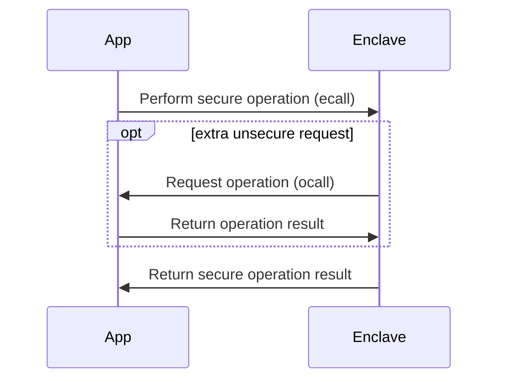
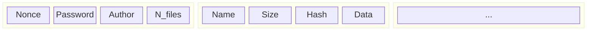

# Table of Contents
- [Table of Contents](#table-of-contents)
- [Introduction](#introduction)
- [Overall structure](#overall-structure)
- [Features and tests](#features-and-tests)
  - [Create a vault](#create-a-vault)
  - [Insert assets](#insert-assets)
  - [Saving the vault](#saving-the-vault)
  - [Loading the vault](#loading-the-vault)
  - [List assets](#list-assets)
  - [Print assets](#print-assets)
  - [Export assets](#export-assets)
  - [Compare assets hash](#compare-assets-hash)
  - [Change passwords](#change-passwords)
  - [Seal and unseal](#seal-and-unseal)
  - [Clone vault](#clone-vault)
- [Conclusions](#conclusions)


# Introduction
The goal of this project is to implement a "tamper-proof digital vault" (TPDV) taking advantage of Intel's SGX enclaves. The TPDV stores digital assets and will be write once, without any possibility of deleting information. A malicious operator may destroy the entire TPDV, but it may not change anything already stored in it without that being detected.

In this report we provide a brief overview of our implementation of the TPDV and show the results of some tests performed when suited. We start out by presenting the [overall structure](#overall-structure) of the system, then we go [feature by feature](#features-and-tests) providing some insight into how they work. In the end, we sum everything in the [conclusions](#conclusions).

# Overall structure


There's two modules, the application `app.cpp`, and the enclave `enclave1.cpp`. All the code inside application is executed **without any extra isolation**, on the other hand the code from `enclave.cpp` is executed inside the SGX enclave. The first thing that the application does, is to create the enclave and every time a critical operation needs to be executed, it performs an `ecall`, e.g. call an enclave method. The enclave runs in a limited environment so, sometimes, it might need to perform an action that has no security risk (e.g. a print, read a file) and can easily be perform outside the enclave. To do so, the enclave does a `ocall` in order to call a method outside the enclave.

For our specific use case, the part of the program that runs outside the enclave has the main goal to provide an interface to the user for him/her to interact with the vault. All the operation that clearly interact with the vault are performed inside the enclave.

# Features and tests

## Create a vault

First of all, a user must be able to create a vault from the application. This vault possesses a few descritionary attributes such as **name**, **password** (in order for a user to be able to access it), the name of its **author** and a counter for the **number of files** it stores. In order to create the vault, the first three atributes must be provided by the user.

```c++
void handleCreateVault(char *vaultName, char *password, char *author)
{
  int returnVal;
  ecallCreateVault(global_eid1, &returnVal, vaultName, password, author);
}
```

From the `app.cpp` this triggers an `ecall` which will call a method from inside the enclave.

```c++
// Enclave1.cpp
int ecallCreateVault(const char *vaultName, const char *psw, const char *author)
{
    _vault = (Vault *)malloc(sizeof(Vault));
    setupVault(_vault);

    setupVaultHeader(&_vault->header, (char *)vaultName, (char *)psw, (char *)author);

    enclavePrintf("Vault created successfully\n");

    saveVault();

    return 0;
}

...

// Vault.cpp
void setupVault(Vault *vault)
{
    vault->state = VALID;
    vault->asset = NULL;
}
...
void setupVaultHeader(VaultHeader *vaultHeader, char *name, char *password, char *author)
{
    memcpy(vaultHeader->name, name, sizeof(vaultHeader->name));
    sgx_read_rand(vaultHeader->nonce, sizeof(vaultHeader->nonce));
    memcpy(vaultHeader->password, password, sizeof(vaultHeader->password));
    memcpy(vaultHeader->author, author, sizeof(vaultHeader->author));
    vaultHeader->numberOfFiles = 0;
}
...
```

This last function `setupVaultHeader` will also be used every time a vault is loaded, and each time is stores a new random nonce in the vault's header for later use.

## Insert assets

For the vault to be useful, a user must be able to place assets inside the vault. This can be done in two way: written content directly from **`stdin`** or as a **file**.

```c++
void handleAddAssetFromKeyboard()
{
  sgx_status_t ret;
  int ret_val;
  char assetName[32];
  char content[256];

  printf("Asset name: ");
  readStdin(assetName, 32);
  printf("Asset content: ");
  readStdin(content, 256);

  ecallInsertAsset(global_eid1, &ret_val, assetName, strlen(assetName) + 1, (uint8_t*)content, strlen(content));
}
```

Either method, besides handling the data differently, will call the `ecallInsertAsset` which will trigger the enclave to insert the asset in the vault.

```c++
// Enclave1.cpp
int ecallInsertAsset(const char *assetName, size_t assetNameSize, const uint8_t *assetData, int assetDataSize)
{
    int err = 0;
    VaultAsset *newAsset = (VaultAsset *)malloc(sizeof(VaultAsset));
    setupVaultAsset(newAsset, (char *)assetName, assetDataSize, (unsigned char *)assetData);
    err = pushAsset(_vault, newAsset);
    if (err != 0)
    {

        if (err == -1)
        {
            enclavePrintf("Unable to insert asset, vault is not in a valid state\n");
        }
        else if (err == -2)
        {
            enclavePrintf("Unable to insert asset, asset name is repeated\n");
        }

        return -1;
    }

    saveVault();

    return 0;
}
...
// Vault.cpp
int setupVaultAsset(VaultAsset *vaultAsset, char *name, size_t contentSize, unsigned char *content)
{
    size_t nameSize = strlen(name) + 1;

    if (nameSize > 32)
        return -1;

    memcpy(vaultAsset->name, name, nameSize * sizeof(char));

    vaultAsset->size = contentSize;

    vaultAsset->content = (unsigned char *)malloc(contentSize * sizeof(unsigned char));
    memcpy(vaultAsset->content, content, contentSize * sizeof(unsigned char));

    sgx_sha256_msg(vaultAsset->content, (uint32_t)contentSize - 1, vaultAsset->hash);

    vaultAsset->next = NULL;
    vaultAsset->previous = NULL;

    return 0;
}
...
```

From this we can see that a bi-linked list is created with the various assets that are store in the vault, and each new asset is pushed into this list. This vault asset contains pointer to the previous and next asset, alongside with the raw content of the asset, the content size, its name and its SHA256 hash.

## Saving the vault

After it as pushed the new asset into th vault, the vault is saved. Saving the vault is specially crucial as it is in this phase where the application ensures the data is correctly packaged for later use and interpretation.

```c++
void saveVault()
{
    int totalAssetsSize = 0;
    VaultAsset *node = _vault->asset;
    while (node != NULL)
    {
        totalAssetsSize += 32 + sizeof(node->name) + sizeof(node->size) + node->size + 32;
        node = node->next;
    }

    char *data = (char *)malloc(sizeof(VaultHeader) + totalAssetsSize);
    if (data == NULL)
    {
        enclavePrintf("Error: Memory allocation failed.\n");
        return;
    }

    memcpy(data, (char *)&_vault->header, sizeof(VaultHeader));

    size_t offset = sizeof(VaultHeader);
    node = _vault->asset;
    while (node != NULL)
    {
        size_t assetSize = 32 + sizeof(node->name) + sizeof(node->size) + node->size + 32;

        memcpy(data + offset, node->hash, 32);
        memcpy(data + offset + 32, node->name, sizeof(node->name));
        memcpy(data + offset + 32 + sizeof(node->name), &node->size, sizeof(node->size));

        memcpy(data + offset + 32 + sizeof(node->name) + sizeof(node->size), &node->hash, 32);
        memcpy(data + offset + 32 + sizeof(node->name) + sizeof(node->size) + 32, node->content, node->size);

        offset += assetSize;
        node = node->next;
    }

    sgx_status_t ret;
    sgx_sealed_data_t *sealed_data = NULL;
    size_t sealed_size = sizeof(sgx_sealed_data_t) + sizeof(VaultHeader) + totalAssetsSize;
    sealed_data = (sgx_sealed_data_t *)malloc(sealed_size);
    if (sealed_data == NULL)
    {
        enclavePrintf("Error: Memory allocation failed.\n");
        free(data);
        return;
    }

    ret = sgx_seal_data(0, NULL, sizeof(VaultHeader) + totalAssetsSize, (uint8_t *)data, sealed_size, sealed_data);
    if (ret != SGX_SUCCESS)
    {
        enclavePrintf("Error: Sealing failed (%#x).\n", ret);
        free(data);
        free(sealed_data);
        return;
    }

    ocallSaveSealedData((uint8_t *)sealed_data, sealed_size, _vault->header.name);

    free(sealed_data);
}
```

First we must allocate enough memory to store the vault headers and whatever content from the assets was pushed into the vault. The vault header size is trivial has it is immutable, but the asset list is dynamic and can contain a various amount of assets. Because of this the application must iterate through the list of assets, and copy each nodes content. This will contain of the information necessary to recreate the file and extract it from the vault, but also its hash (we will see its use later on).

## Loading the vault

When loading the vault from a file, the user must provide the vault name and the password, this information will be passed via an `ocall` to be processed inside the enclave. There the password provided will be match against the one stored inside the vault and if successful the vault will be loaded and made available.

```c++
int loadVault(const char *fileName)
{
    sgx_status_t ret = SGX_ERROR_UNEXPECTED;
    int sealed_size;

    // This size can be considered de maximum size of the vault
    sgx_sealed_data_t *sealed_data = (sgx_sealed_data_t *)malloc(1024 * 16);
    char *unsealed_data = (char *)malloc(1024 * 16);

    ocallLoadSealedData(&sealed_size, (uint8_t *)sealed_data, fileName);
    if (!sealed_data)
    {
        return 1;
    }

    ret = sgx_unseal_data(sealed_data, NULL, NULL, (uint8_t *)unsealed_data, (uint32_t *)&sealed_size);
    if (ret != SGX_SUCCESS)
    {
        enclavePrintf("Error: Unsealing failed\n");
        return 1;
    }

    setupVaultHeader(&_vault->header, &unsealed_data[32], &unsealed_data[64], &unsealed_data[96]);

    enclavePrintf("Loading assets...\n");
    int i = sizeof(VaultHeader);
    while (i < sealed_size)
    {
        VaultAsset *newAsset = (VaultAsset *)malloc(sizeof(VaultAsset));

        sgx_sha256_hash_t hash;
        memcpy(&hash, &unsealed_data[i + 68], 32);

        setupVaultAsset(newAsset, &unsealed_data[i + 32], unsealed_data[i + 64], (unsigned char *)&unsealed_data[i + 100]);

        if (!ecallCheckDigest(newAsset->name, (const char *)hash))
        {
            return 2;
        }

        pushAsset(_vault, newAsset);
        i += 68 + newAsset->size;
    }

    return 0;
}
```

The first step will be to unseal the date (this is explained [here](#seal-and-unseal)), it then mount the vault header and load the assets into the bi-linked asset list.

Because the application cannot trust the vault blindly, it will (as it loads each asset), calculate its hash and match it against the hash stored in the vault. This solution is not perfect, as if an attacker is able to modify the content it could also modify the hash, but it does offer some sort of prevention against unindent modification to the data.

## List assets

Listing files is also handled via an `ecall` witch will trigger the code inside the enclave to iterate through the vault assets, and print information such as name, size.

```c++
int ecallListAssets()
{
    if (getState(_vault) != VALID)
    {
        enclavePrintf("Unable to list assets, vault is not in a valid state\n");
        return -1;
    }

    enclavePrintf("Vault asset list:\n");

    VaultAsset *node = _vault->asset;

    int i = 1;
    while (node != NULL)
    {
        enclavePrintf("%d - name: %s , size: %d \n", i, node->name, node->size);
        node = node->next;
        i++;
    }

    return 0;
}
```

## Print assets

Printing assets works in a similar fashion to the last functionality, but know the `ecall` will trigger the enclave to print the files **content** to `stdout`.

```c++
int ecallPrintAsset(char *name)
{
    VaultAsset *node = _vault->asset;

    while (node != NULL && strcmp(node->name, name) != 0)
        node = node->next;

    if (node != NULL)
    {
        enclavePrintf("-----------\n'%s' content \n-----------\n%s\n-----------\n", name, node->content);
        return 0;
    }

    return 1;
}
```

This is obviously useful for text-based content, not as useful for files.

## Export assets

If a user chooses to retrieve a file it has stored as an asset in the vault, it must be able to export it to a new file. Calling `ecallSaveAssetToFile` and providing the asset name and a new for the new file, the enclave will be able to handle this request.

```c++
int ecallSaveAssetToFile(char *assetName, char *fileName)
{
    VaultAsset *node = _vault->asset;

    while (node != NULL && strcmp(node->name, assetName) != 0)
        node = node->next;

    if (node != NULL)
    {
        ocallSaveDataToFile((const char *)node->content, node->size, fileName);
        return 0;
    }

    return 1;
}
```

The enclave will search the asset list and retrieve its content. Because the enclave is isolated, it must perform an `ocall` for the application to handle the process of writting the extracted data to the new object file.

```c++
void ocallSaveDataToFile(const char *data, int siz, const char *fileName)
{
  FILE *file = fopen(fileName, "w");

  if (file == NULL)
  {
    fprintf(stderr, "Error opening the file.\n");
    return;
  }

  size_t numBytesWritten = fwrite(data, sizeof(char), siz, file);

  fclose(file);
}
```

## Compare assets hash

A user may also whish to verify if an asset stored in the vault is the correct one, and for that it should be able to compare its hash with one he/she possesses.

By triggering `ecallCheckDigest`, the user is able to provide the text-based hash (provided by tools such as `sha256sum`) and match it against the one now calculated by the enclave.

```c++
char ecallCheckDigest(const char *assetName, const char *digest)
{
    VaultAsset *node = _vault->asset;

    while (node != NULL && strcmp(node->name, assetName) != 0)
        node = node->next;

    if (node != NULL)
        return strcmp((char *)node->hash, digest);

    return -2;
}
```

## Change passwords

A user may wish to change the password for the vault. This needs to be done securely and as such it must be done inside the enclave. By calling `ecallChangePassword` this can be achieved.

```c++
int ecallChangePassword(const char *newPsw, size_t newPswSize)
{
    if (newPswSize > 32)
    {
        enclavePrintf("Password size exceeded max size (max := %d, received %d)\n", 32, newPswSize);
        return -1;
    }

    changePassword(_vault, (char *)newPsw);
    enclavePrintf("Sucessfully changed vault password\n");

    saveVault();

    return 0;
}
```

This will simply replace the password store in the header by the new password provided an saving the vault will seal the data.

## Seal and unseal


In order to keep the vault trough multiple executions of the enclave, the vault data need to exported into a file that later can be imported. To do that, every time vault is created or modified, all of its data is sealed and stored in a file with the same name as the vault. To seal the data the keys generated by the enclave are used, this key is derived from a CPU specific key and a key extracted from the logs generated when creating the enclave.

With the sealed data inside the vault file, the program is able to load the vault keeping its previous state. Also, taking advantage of the store hash value for each file, it detects when files were corrupted.

## Clone vault
Clone a vault from a remote host was implemented using TLS communication. It consists of a TLS server which waits for clients and a client that requests the vault.


TLS requires trusted certificates to run properly, a script obtained from (here)[https://github.com/diogoftm/simulated-kms/blob/main/certs/makefile] which generates certificates signed by a self signed CA. These certificates are loaded by the server and the client.

Implementation of client and server can be found in `src/App/AppSocket.cpp`. A simple message exchange protocol was built to support base communication (`BaseMessageLayer`).

The clone happens on top of that protocol, both server and client communication depends on a callback passed as argument to setup functions (see `TlsClient::connect(...)`  and `TlsServer::run_server(...)`). Both callbacks were defined in `src/App.cpp` (`serveClientCallback(SSL* ssl)` and `clientConnectionWithServerCallback(SSL* ssl)`).

Clone was divided in some phases, after communication is initialized the following steps (in case of success) happen.

1. Client sends a request clone message.
2. Server asks for vault name.
3. Client asks user for vault name, (if it's not present in server, server responses with a invalid vault message response and the communication terminates).
4. Server transmits unsealed vault data (encrypted with hash of the vault password using AESGCM algorithm), data is obtained from `ecallGetUnsealedCipheredData`.
5. Client sends an ok message after clone is completed.
6. Server sends a close session message.

After clone is completed, client will ask user for the vault password and will decipher it inside the enclave using the same process as the server (AESGCM with the password hash).

Server is not validating the client certificate, it could be implemented by adding some extra steps which could include asking for the client certificate, verifying if is the same as the server and then asking for a challenge to be signed by the client (proof that client has the private certificate key).

# Conclusions