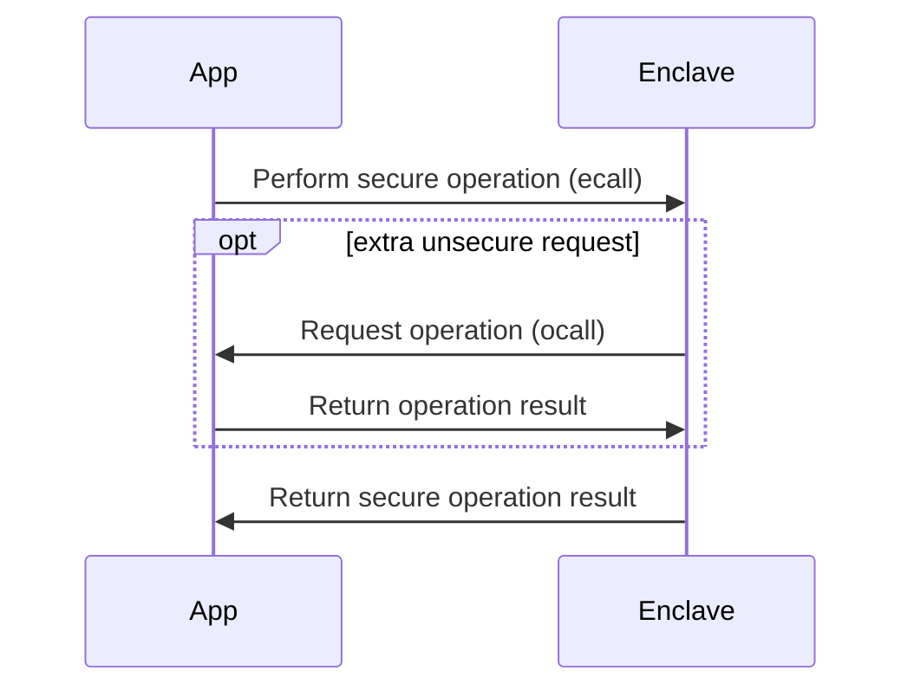
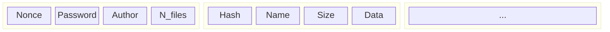

# Table of Contents
- [Table of Contents](#table-of-contents)
- [Introduction](#introduction)
- [Overall structure](#overall-structure)
- [Features and tests](#features-and-tests)
  - [Insert assets](#insert-assets)
  - [List assets](#list-assets)
  - [Print assets](#print-assets)
  - [Export assets](#export-assets)
  - [Compare assets hash](#compare-assets-hash)
  - [Change passwords](#change-passwords)
  - [Seal and unseal](#seal-and-unseal)
  - [Clone vault](#clone-vault)
- [Conclusions](#conclusions)

# Introduction
The goal of this project is to implement a "tamper-proof digital vault" (TPDV) taking advantage of Intel's SGX enclaves. The TPDV stores digital assets and will be write once, without any possibility of deleting information. A malicious operator may destroy the entire TPDV, but it may not change anything already stored in it without that being detected.

In this report we provide a brief overview of our implementation of the TPDV and show the results of some tests performed when suited. We start out by presenting the [overall structure](#overall-structure) of the system, then we go [feature by feature](#features-and-tests) providing some insight into how they work. In the end, we sum everything in the [conclusions](#conclusions).

# Overall structure

Basically, there's two modules the application (`app.cpp`) and the enclave (`enclave1.cpp`). All the code inside application is executed without any extra isolation, on the other hand the code inside enclave is performed inside the SGX enclave. The first thing that the application does is to create the enclave and every time a critical operation needs to be executed, it performs an `ecall`, e.g. call an enclave method. The enclave runs in a limited environment so, sometimes, it might need to perform an action that has no security risk (e.g. a print, read a file) and can easily be perform outside the enclave. To do so, the enclave does a `ocall` in order to call a method outside the enclave.

For our specific use case, the part of the program that runs outside the enclave has the main goal to provide an interface to the user for him/her to interact with the vault. All the operation that clearly interact with the vault are performed inside the enclave.

# Features and tests

## Insert assets

## List assets

## Print assets

## Export assets

## Compare assets hash

## Change passwords

## Seal and unseal

In order to keep the vault trough multiple executions of the enclave, the vault data need to exported into a file that later can be imported. To do that, every time vault is created or modified, all of its data is sealed and stored in a file with the same name as the vault. To seal the data the keys generated by the enclave are used, this key is derived from a CPU specific key and a key extracted from the logs generated when creating the enclave.

With the sealed data inside the vault file, the program is able to load the vault keeping its previous state. Also, taking advantage of the store hash value for each file, it detects when files were corrupted.

## Clone vault

# Conclusions