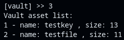
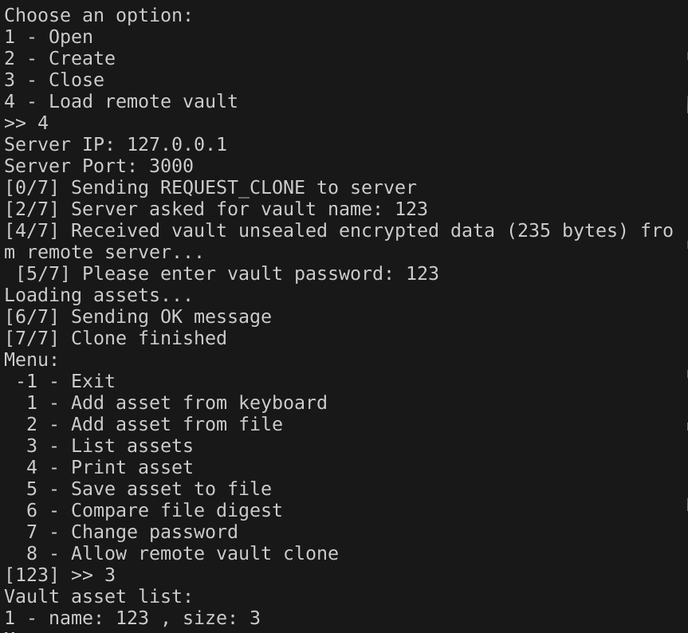

# Table of Contents
- [Table of Contents](#table-of-contents)
- [Introduction](#introduction)
- [Overall structure](#overall-structure)
- [Features and tests](#features-and-tests)
  - [Create a vault](#create-a-vault)
  - [Insert assets](#insert-assets)
  - [Saving the vault](#saving-the-vault)
  - [Loading the vault](#loading-the-vault)
  - [List assets](#list-assets)
  - [Print assets](#print-assets)
  - [Export assets](#export-assets)
  - [Compare assets hash](#compare-assets-hash)
  - [Change passwords](#change-passwords)
  - [Seal and unseal](#seal-and-unseal)
  - [Clone vault](#clone-vault)
- [Conclusions](#conclusions)


# Introduction
The objective of this project is to develop a "tamper-proof digital vault" (TPDV) leveraging Intel's SGX enclaves. The TPDV is designed to securely store digital assets in a write-once manner, preventing any alteration or deletion of stored information. Although a malicious operator could potentially destroy the entire TPDV, they cannot modify any existing data without detection.

This report offers a concise overview of our TPDV implementation, along with the results from various conducted tests. We commence by outlining the [overall structure](#overall-structure) of the system, followed by a detailed examination of its individual [feature by feature](#features-and-tests). Finally, we consolidate our findings in the [conclusions](#conclusions).

# Overall structure
```{.mermaid width=300 caption="Overall flow of a vault operation"}
sequenceDiagram
    App->>Enclave: Perform secure operation (ecall)
    opt extra unsecure request
        Enclave->>App: Request operation (ocall)
        App->>Enclave: Return operation result
    end
    Enclave->>App: Return secure operation result
```

There are two modules in this project: the application `app.cpp` and the enclave `Enclave1.cpp`. The code within the application module runs **without any additional isolation**, while the code within `Enclave1.cpp` executes within the secure confines of an SGX enclave.

Upon initialization, the application creates the enclave, and **whenever a critical operation is required**, such as accessing sensitive data, it invokes an `ecall` to execute a method within the enclave. Although the enclave operates within a restricted environment, there are instances where it may **need to perform non-sensitive actions, such as printing or reading a file, which can be safely executed outside the enclave**. In such cases, the **enclave utilizes an** `ocall` to invoke methods external to the enclave.

In our specific scenario, the portion of the program running outside the enclave primarily serves as an interface for user interaction with the vault. All operations directly involving the vault's data are securely conducted within the enclave.

# Features and tests

## Create a vault

Initially, users should have the capability to create a vault from within the application. This vault includes several discretionary attributes, namely a **name**, a **password** (for user access), the **author's name**, and a counter for the **number of files** it contains. To create the vault, users must provide the first three attributes.

```{.mermaid caption="Create vault flow"}
sequenceDiagram
    App ->> Enclave: ecallCreateVault(vaultName, password, author)
    Enclave ->> Vault: setupVaultHeader(vaultName, password, author)
```

The `setupVaultHeader` function will also be utilized whenever a vault is loaded, ensuring that a new random nonce is stored in the vault's header for future utilization.

{width=30%}

## Insert assets

To make the vault functional, users need the ability to deposit assets into it. This can be achieved in two ways: either by entering content directly from `stdin` or by uploading a file. Regardless of the chosen method, the data is initially acquired from various sources and then transferred to the enclave via an `ecall`.

```{.mermaid caption="Insert asset vault flow"}
sequenceDiagram
    alt from stdin
        App ->> Enclave: ecallInsertAsset(assetName, assetNameLength, content, contentLength)
    else from file
        App ->> Enclave: ecallInsertAsset(assetName, assetNameLength, content, contentLength)
    end
    Enclave ->> Vault: setupVaultAsset(assetName, assetDataSize, content)
    Vault ->> Vault:saveVault
    
```

A bidirectional linked list of assets is established to manage the stored assets within the vault. Each new asset is appended to this list. Each vault asset includes pointers to the previous and next assets, along with the raw content, content size, name, and SHA256 hash of the asset.

```{.mermaid width=400 caption="Asset structure"}
block-beta
    block
        hash
        name
        size
        content
        next
        previous
    end
```


## Saving the vault

After pushing the new assets into the vault, the vault is saved. This phase is particularly critical as it's where the application ensures the data is correctly organized for future use and interpretation.

Initially, we allocate sufficient memory to store the vault headers and the content from the assets that was pushed into the vault. **The vault header size is fixed, being immutable, while the asset list is dynamic and can accommodate varying numbers of assets.** The assets are stored as a continuous data block, with each asset forming a segment of this block structured as follows.

```{.mermaid caption="Saving vault structure"}
flowchart LR
    A[Calculate total size of assets plus the header size] --> B[Store header]
    C[Iterate through assets and store]
    B --> C

    subgraph Vault
        D[Vault header]
        
        subgraph Asset01
            E[Hash]
            F[Name]
            G[Size]
            H[Content]
        end
        subgraph Asset02
            I[Hash]
            J[Name]
            K[Size]
            L[Content]
        end
        
        ...
    end

    C --> Asset01
    C --> Asset02
```

Consequently, the application iterates through the list of assets, copying the content of each node. This content encapsulates all the necessary information to reconstruct the file and extract it from the vault later. Additionally, it stores the hash of each asset for subsequent use.

## Loading the vault

When loading the vault from a file, the user is required to provide the vault name and password. This information is then passed via an `ocall` to be processed within the enclave. Inside the enclave, the provided password is matched against the one stored within the vault. If the comparison is successful, the vault is loaded and made accessible.

The initial step involves unsealing the data (detailed explanation found [here](#seal-and-unseal)), followed by mounting the vault header and loading the assets into the bidirectional asset list.

```c++
...
ret = sgx_unseal_data(sealed_data, NULL, NULL, (uint8_t *)unsealed_data, (uint32_t *)&sealed_size);
...
```

As the application cannot blindly trust that the vault has not been tampered with, it employs a verification process: upon loading each asset, it calculates its hash and compares it against the hash stored alongside with the asset itself. While this solution isn't foolproof, as an attacker capable of modifying the content could also alter the hash, it does provide a degree of protection against unauthorized data tampering or data corruption.

```c++
...
sgx_sha256_hash_t hash;
memcpy(&hash, &unsealed_data[i + 68], 32);

setupVaultAsset(newAsset, &unsealed_data[i + 32], unsealed_data[i + 64], (unsigned char *)&unsealed_data[i + 100]);

if (!ecallCheckDigest(newAsset->name, (const char *)hash))
{
    return 2;
}
...
```

## List assets

Listing files is also managed through an `ecall`, which triggers the enclave code to iterate through the vault assets and print relevant information such as name and size.

```{.mermaid width=300 caption="List assets flow"}
sequenceDiagram
    App ->> Enclave: ecallListAssets
```

```c++
...
while (node != NULL)
{
    enclavePrintf("%d - name: %s , size: %d \n", i, node->name, node->size);
    node = node->next;
    i++;
}
...
```



## Print assets

Printing assets operates similarly to the previous functionality. However, in this case, the `ecall` prompts the enclave to print the content of the files to `stdout`. While this is highly useful for text-based content, it may not be as practical for binary files, as their raw binary data will be printed as output.

```{.mermaid width=300 caption="Print asset flow"}
sequenceDiagram
    App ->> Enclave: ecallPrintAsset
```

```c++
...
while (node != NULL && strcmp(node->name, name) != 0)
node = node->next;

if (node != NULL)
{
    enclavePrintf("-----------\n'%s' content \n-----------\n%s\n-----------\n", name, node->content);
    return 0;
}
...
```


## Export assets

If a user chooses to retrieve a file it has stored as an asset in the vault, it must be able to export it to a new file. Calling `ecallSaveAssetToFile` and providing the asset name and a new for the new file, the enclave will be able to handle this request.

```{.mermaid width=400 caption="Export asset flow"}
sequenceDiagram
    App ->> Enclave: ecallSaveAssetToFile(assetName, fileName)
    Enclave ->> App:ocallSaveDataToFile(assetContent, assetSize, fileName)
```

When a user opts to retrieve a file stored as an asset in the vault, they must be able to export it to a new file. By invoking `ecallSaveAssetToFile` and specifying the asset name along with a new file name, the enclave can process this request.


## Compare assets hash

A user may also wish to verify if an asset stored in the vault is the correct one. For this purpose, they should be able to compare its hash with one they possess. By invoking `ecallCheckDigest`, the user can provide the text-based hash, typically obtained from tools like `sha256sum`, to match it against the one calculated by the enclave. This comparison enables users to confirm the integrity and authenticity of the stored asset.

```{.mermaid width=300 caption="Compare asset hash flow"}
sequenceDiagram
    App ->> Enclave: ecallCheckDigest(assetName, digest)
```


## Change passwords

A user may wish to change the password for the vault, a process that needs to be conducted securely within the enclave. This can be accomplished by calling `ecallChangePassword`.

```{.mermaid caption="Change password flow"}
sequenceDiagram
    App ->> Enclave: ecallChangePassword(newPassword, sizeNewPassword)
    Enclave ->> Vault: changePassword(newPassword)
    Vault ->> Vault: saveVault
```

This operation will replace the password stored in the header with the new one provided. Subsequently, saving the vault will seal the data, ensuring its security.


## Seal and unseal
```{.mermaid width=600 caption="Sealed data structure"}
block-beta
    block
        Nonce
        Name
        Password
        Author
        N_files
    end
    block
      Name
      Size
      Hash
      Data
    end
    block
      ...
    end
```

To ensure persistence across multiple executions of the enclave, the vault data needs to be exported into a file that can later be imported. To achieve this, whenever the vault is created or modified, all of its data is sealed and stored in a file with the same name as the vault. The sealing process utilizes keys generated by the enclave, derived from a CPU-specific key and a key extracted from the logs generated during enclave creation.

With the sealed data stored within the vault file, the program is capable of loading the vault while maintaining its previous state. Additionally, leveraging the stored hash values for each file, it can detect instances where files have been corrupted.

## Clone vault
Implementing the cloning of a vault from a remote host was achieved using TLS communication. This involved setting up a TLS server that waits for client connections, and a client that initiates the request for the vault.

{ width=70% }

TLS operation necessitates trusted certificates for proper functioning. To fulfill this requirement, a script (obtained from (here)[https://github.com/diogoftm/simulated-kms/blob/main/certs/makefile]) was utilized to generate certificates signed by a self-signed CA. These certificates are then loaded by both the server and the client.

In the `src/App/AppSocket.cpp` file, you can find the implementation of both the client and server components. We've developed a simple message exchange protocol, termed the `BaseMessageLayer`, to support basic communication.

The cloning process builds upon this protocol. Both server and client communication rely on callbacks passed as arguments to setup functions, as demonstrated in `TlsClient::connect(...)` and `TlsServer::run_server(...)`. These callbacks, namely `serveClientCallback(SSL* ssl)` and `clientConnectionWithServerCallback(SSL* ssl)`, are defined in `src/App.cpp`.

The cloning operation is divided into several phases. After initializing communication, the following steps occur (assuming success).

1. Client sends a request clone message.
2. Server asks for vault name.
3. Client asks user for vault name, (if it's not present in server, server responses with a invalid vault message response and the communication terminates).
4. Server transmits unsealed vault data (encrypted with hash of the vault password using AESGCM algorithm), data is obtained from `ecallGetUnsealedCipheredData`.
5. Client sends an ok message after clone is completed.
6. Server sends a close session message.

After the cloning process is completed, the client prompts the user for the vault password and decrypts it within the enclave using the same process as the server (AESGCM with the password hash).

Currently, the server does not validate the client certificate. This functionality could be implemented by introducing additional steps, such as requesting the client certificate, verifying if it matches the expected certificate on the server side, and then requesting a challenge to be signed by the client as proof that it possesses the private certificate key.

Server             |  Client
:-------------------------:|:-------------------------:
{ width=50% }  |  { width=50% }

# Conclusions
This project showcases the robust capabilities of Intel SGX as a secure mechanism for safeguarding sensitive data during execution. By encapsulating critical processes within SGX enclaves, it creates a fortified environment where data handling occurs with heightened security.

This vault empowers users to confidently manage, store, and transport sensitive data that would otherwise be vulnerable to exposure. Leveraging Intel SGX enclaves ensures that even in potentially compromised environments, data remains protected, preserving its confidentiality and integrity throughout its lifecycle.
